# QA Project 2 - My generator project 

## Objectives

The aim of this project was to create a functioning application that would consist of four different services to run with one another to create a running app. Service 1 would talk or communicate with the rest of the three services and would run render templates. Service 2 and service 3 are bits of code that create random objects based on the options that were placed inside it. Service 4 would also create an object but wold use the objects from service 2 and 3 to create the third object, which then all go into the first service and be used further on.

In this project, a variety of different services have been used in order to make this project successful. The Kanban board choice of use is the Trello Board which helps me organise waht tasks i need to do and when. A risk assessment is also created to show different issues that could occur and how much it would impact the project. I have used Github as the version control and Jenkins as tbe CI server. To deploy the project, it must be containarised and orchestrated and for me to do that, I have used Ansible. And the project uses NGINX as the reverse Proxy. 

## Planning:

To plan my project, I have used Trello Board to create a list of actions that need to be done. This was very beneficial as it helped me keep track of what im doing and what i have left to do.

        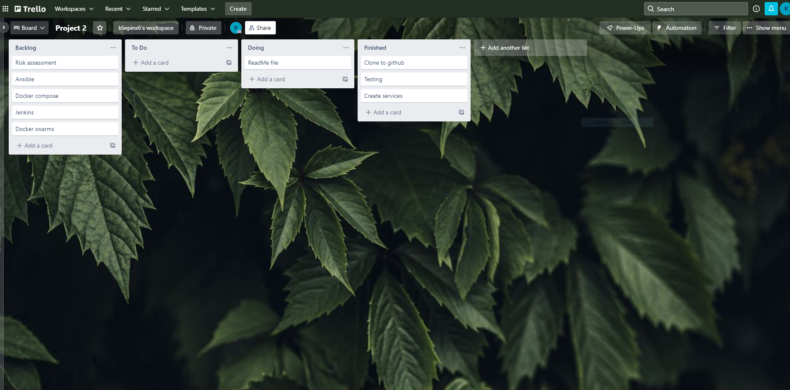

After the Planning has been made, a risk assessment was crutial to be carried out as I needed to know what could impact my project negatively. I have described the scenario that could occur along  with the impact level and who would be responsible for the result. Below I have displayed my risk assessment of my project...

        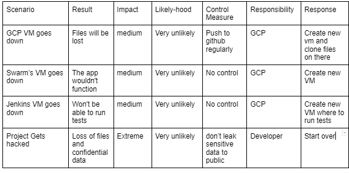

## My app:

The application i have built is a random damage generator. From the different services, it generates a random gun and also a random body part and depending of the two, it will calculate the amount of damage you take.
 
My service 1 receives objects from the other services and then generates a render template and puts the values of the objects into it:

        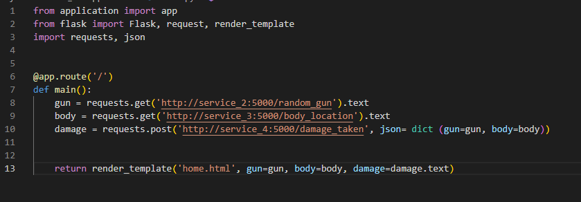

My service 2 generates a random gun from a list I have created. The list is involving different types of guns: 

        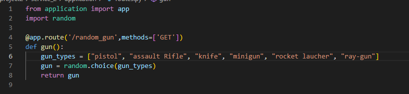

My service 3 also generates an object but instead of a gun, it now generates a body part where the bullet will shoot. Below you can see the service 3 and what body parts i have included in the list:

        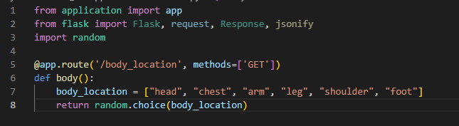

In my service 4, it would create the damage dealt from the objects that were generated and from the numbers I have assigned to each object, which would then calculate the resulting damage :

        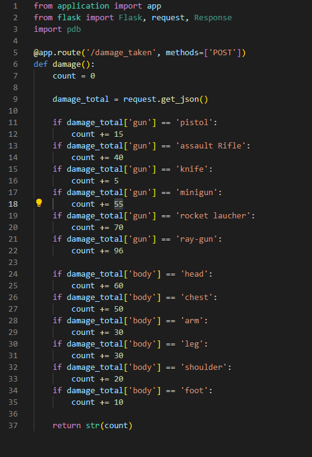

When the app is run and everything has been generated, this is what the resulting web page will look like from a viewers point of view: 

        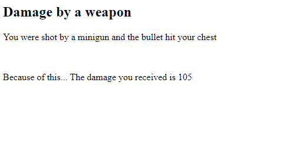

## Testing

Testing was crutial as it would check that everything was functional and that there arent any errors in the code. I had tests made from each of the four services and the coverage is 100% for each one of them. The results of the tests are shown below:

        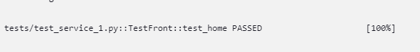

        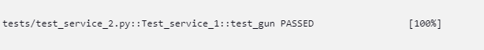

        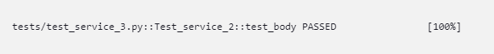

        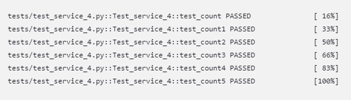

My tests were taken from the console output on Jenkins and as you can see in services 1-3 i was able to get the coverage to 100% first try but with service 4 i have to test a couple times and add more tests to it for the coverage to be at 100%.

## Pipeline

For my pipeline, I have used Jenkins to build a variety of steps so that my app can be deployed properly. I have linked my Jenkins to the app i am working on and have created a webhook which will automatically run the builds to make sure everything is still functional after each change. From the picture below, you can see that it took me many attempts to get my Jenkins build running but in the end, i was able to get everything working. 

        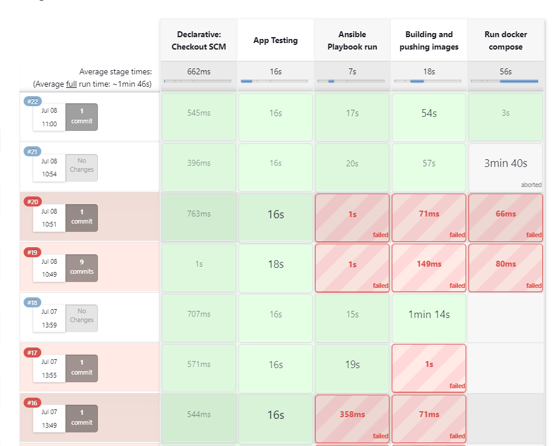

There are multiple steps that the pipeline does in order to make sure everything is working how it is intended. Firsly, it would run my app tests that I have implemented. Following up with Running my ansible playbook, building my images and pushing then. Finally, the images get run and start to function. Ansible was able to run successfully as I have been able to connect it to the swarm manager and swarm worker and you can see by the picture below that ansible was able to connect to each of them and ping them:

        

## Conclusion:

In conclusion, it was a very interesting and fun project along with some challenges that got me thinking about what the problem could be but also from the help of my trainer and fellow friends, I was able to get everything up and running for my app. While discussing this, I am constantly updating my app to make it more efficient and more eye appealing for the user. Thank you

