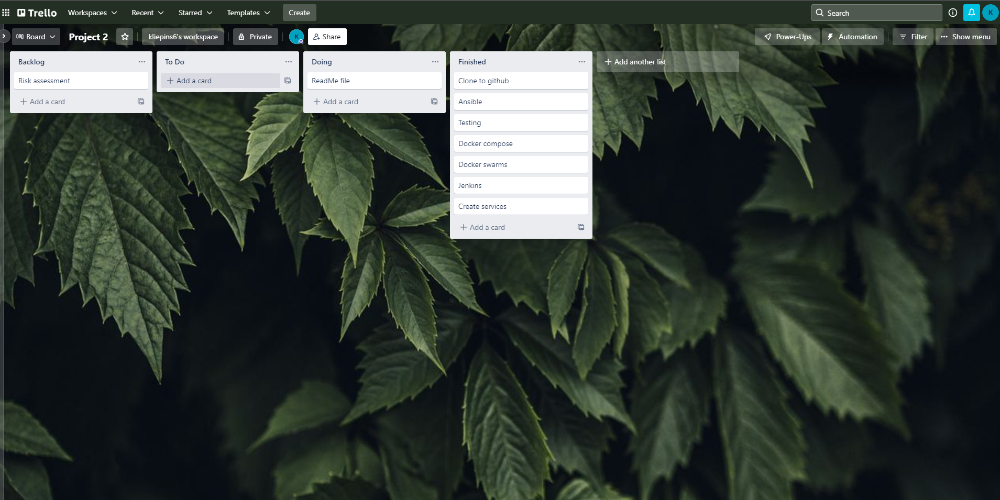

# QA Project 2 - My generator project 

## Objectives

The aim of this project was to create a functioning application that would consist of four different services to run with one another to create a running app. Service 1 would talk or communicate with the rest of the three services and would run render templates. Service 2 and service 3 are bits of code that create random objects based on the options that were placed inside it. Service 4 would also create an object but would use the objects from service 2 and 3 to create the third object, which then all go into the first service and be used further on.

In this project, a variety of different services have been used in order to make this project successful. The Kanban board choice of use is the Trello Board which helps me organise waht tasks i need to do and when. A risk assessment is also created to show different issues that could occur and how much it would impact the project. I have used Github as the version control and Jenkins as tbe CI server. To deploy the project, it must be containarised and orchestrated and for me to do that, I have used Ansible. And the project uses NGINX as the reverse Proxy. 

## Planning:

To plan my project, I have used Trello Board to create a list of actions that need to be done.

        

